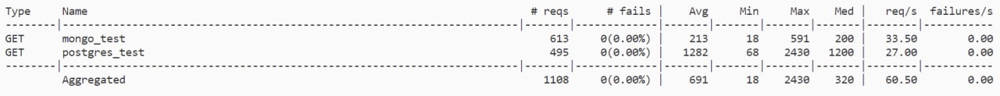
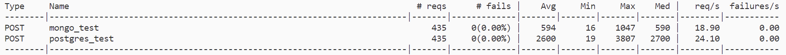

## Описание

Для сравнения производительности Монги и Постгреса решено использовать: 
1. получение пользователем рецензии и связанных с ней данными - лайками.
2.  оставление лайка к ревью. 

Схемы данных находятся в ./docker. 

## Подготовка

1. `docker-compose up -d`
2. Свагер доступен на localhost:5000/docs (у рецензий числовой айди от 1 до 500 тыс., можно потыкать;) )
3. Создаем виртуальное окружение.
4. pip install -r requirements.txt
5. `make load` - загрузит 500 000 сгенерированных рецензий и два миллиона лайков.
   Скрипты загрузки лежат в ./data_load

## Тестирование

Для тестирования используется библиотека locust. 
1. Команда `make easy_get` запустит тест в изи режиме (100 юзеров). Видно, что Монга справляется на порядок быстрее.

2. Далее выжмем базы на максимум. Make-команды `extreme_mongo_get` и `extreme_pg_get` создадут 1000 юзеров. Видно, что Постгрес падает почти сразу, а Монга держится. 
3. Аналогично тестим запись командами `easy_insert`, `extreme_insert_pg`, `extreme_insert_mongo`. 

## Вывод

**В нашем конкретном случае Монга быстрее и на чтение, и на запись. Ее и выбираем.**
